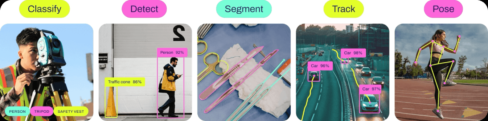

# YOLO11 Object Detection 🚀

YOLO11 is the next-generation computer vision model by Ultralytics, offering cutting-edge advancements in accuracy, speed, and efficiency for a range of tasks like object detection, instance segmentation, pose estimation, and more!



This repository provides an implementation of the YOLO11 object detection model with simple inference examples for images and videos.

## Table of Contents

- [YOLO11 Object Detection 🚀](#yolo11-object-detection-)
  - [Table of Contents](#table-of-contents)
  - [Features](#features)
  - [Installation](#installation)
- [Usage](#usage)
  - [Inference on Images](#inference-on-images)
- [Load YOLO11 model](#load-yolo11-model)
- [Read the image](#read-the-image)
- [Define the prediction function](#define-the-prediction-function)
    - [Training a YOLO11 Model](#training-a-yolo11-model)
  - [Performance](#performance)
  - [🔔 Stay Updated!](#-stay-updated)

## Features

- 🔧 Optimized architecture with fewer parameters and higher accuracy.
- ⚡ Faster inference speeds ideal for real-time applications.
- 💡 Versatility across detection, segmentation, pose estimation, and more.

## Installation

To get started with YOLO11, first, install the necessary libraries:

```bash
pip install opencv-python ultralytics
```

# Usage

## Inference on Images

Follow these steps to perform object detection on an image using the YOLO11 model:

```python
Copy code
import cv2
from ultralytics import YOLO
```

# Load YOLO11 model

```model

```

# Read the image

```python
image = cv2.imread("image.png")
```

# Define the prediction function

```python
def predict_and_detect(chosen_model, img, classes=[], conf=0.5, rectangle_thickness=2, text_thickness=1):
    results = chosen_model.predict(img, classes=classes, conf=conf)
    for result in results:
        for box in result.boxes:
            cv2.rectangle(img, (int(box.xyxy[0][0]), int(box.xyxy[0][1])),
                          (int(box.xyxy[0][2]), int(box.xyxy[0][3])), (255, 0, 0), rectangle_thickness)
            cv2.putText(img, f"{result.names[int(box.cls[0])]}",
                        (int(box.xyxy[0][0]), int(box.xyxy[0][1]) - 10),
                        cv2.FONT_HERSHEY_PLAIN, 1, (255, 0, 0), text_thickness)
    return img, results

# Predict and detect objects

result_img, _ = predict_and_detect(model, image, classes=[], conf=0.5)

# Show and save the result image

cv2.imshow("Detected Image", result_img)
cv2.imwrite("result.jpg", result_img)
cv2.waitKey(0)
```

### Training a YOLO11 Model

To train a YOLO11 model for object detection:

```python
from ultralytics import YOLO

# Load a YOLO11n model
model = YOLO("yolo11n.pt")

# Train on a dataset (e.g., COCO)
results = model.train(data="coco8.yaml", epochs=100, imgsz=640)
```

Model Variants
YOLO11 offers different model variants to cater to a range of requirements in terms of speed and accuracy. Here is a comparison of the various YOLO11 models:

| Model   | Parameters | mAP  | Speed (ms) |
| ------- | ---------- | ---- | ---------- |
| YOLO11n | 2.6M       | 39.5 | 1.55       |
| YOLO11s | 9.4M       | 47.0 | 2.46       |
| YOLO11m | 20.1M      | 51.5 | 4.70       |
| YOLO11l | 25.3M      | 53.4 | 6.16       |
| YOLO11x | 56.9M      | 54.7 | 11.31      |

## Performance

YOLO11 delivers substantial improvements over previous versions, combining enhanced accuracy with faster inference times. Here are some key highlights:

Up to 22% fewer parameters compared to YOLOv5, resulting in more lightweight models.
Up to 2% faster inference speeds, making it ideal for real-time applications.
Supports real-time detection for diverse use cases, including:


* Video surveillance
* Autonomous driving
* Healthcare applications
* Industrial automation

## 🔔 Stay Updated!
Follow the project for more updates on YOLO11, computer vision, and AI technology. 🚀